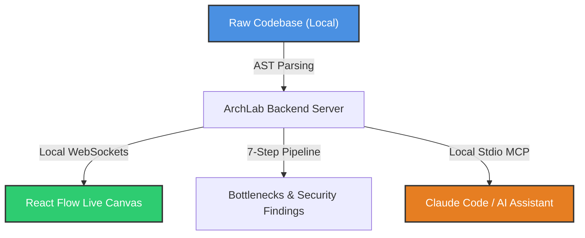

# ArchLab Pitch Structure: IBM Bob AI Builders Challenge
**Track:** Intelligent Systems for the Future of Work (Wildcard)

---

## 1. The Hook (The 10-Second Pitch)
> "ArchLab is a privacy-first, 100% local engineering command center and AI brain. It instantly maps any codebase into a live, interactive architecture canvas, runs automated diagnostic check pipelines, and exposes this system intelligence locally to AI tools without a single byte of code ever leaving the developer's machine."

---

## 2. The Problem
* **The "Black Box" Codebase:** Reading thousands of lines of code to understand backend-to-frontend flows, database relationships, and API routes is slow and mentally exhausting.
* **The AI Privacy Dilemma:** Developers want AI help, but enterprise security rules restrict sending proprietary source code or intellectual property to cloud-based AI endpoints.
* **The Static Report Gap:** Existing security/performance scanners output boring, static text logs that are hard to visualize or take action on immediately.

---

## 3. The Solution & Core Value Pillars

* **100% Local-First:** Runs entirely on `localhost`. WebSockets, AST parsing, and SQLite/Markdown storage are completely offline. Zero network calls mean absolute enterprise security.
* **Interactive & Visual:** Translates file dependencies into swimlanes (Frontend vs. Backend), entry-point depth hierarchies, and interactive relation paths. Hover to trace, click to lock, slide in code.
* **AI-Native via MCP:** Exposes the parsed system brain to external AI assistants over standard input/output (Stdio). The AI tools become codebase-aware instantly without uploading files to the cloud.

---

## 4. The 3-Minute Demo Walkthrough Flow

| Step | Action | Visual Impact | Key Message |
| :--- | :--- | :--- | :--- |
| **1. The Launch** | Run `archlab --check` in the terminal inside a messy project. | CLI parses the codebase and opens the browser to `localhost:5317` showing the 7-step pipeline animating live. | "Fast, automated ingestion. Zero manual configuration." |
| **2. The Map** | Explore the **Full Flow** tab. Hover over backend API nodes to show labeled connector ports (CREATE, UPDATE, etc.). | Swimlanes light up, highlighting active connections while unrelated files fade back. | "Complex systems instantly become readable. You see data flow, not just import paths." |
| **3. The Intel** | Click an API node. The **Code Intelligence Panel** slides in with symbol navigation and context-aware action triggers. | Inline code explanations and quick actions appear based on pipeline security/performance checks. | "Code analysis is brought directly into the editor view with actionable solutions." |
| **4. Database Sync** | Open the **Database** tab. Paste raw `CREATE TABLE` SQL scripts. | The canvas generates interactive table cards showing foreign key relations, PK indicators, and inferred references. | "Visual schema design that syncs seamlessly with actual database architecture." |
| **5. The MCP Connection** | Show a terminal query using Claude Code querying the local MCP server. | The AI agent explains the system layout using tools powered by the local ArchLab brain. | "Your AI tools get an instant, private roadmap of the entire codebase." |

---

## 5. Strategic Value: Why the Judges Care
1. **Unlocking Enterprise AI (Privacy):** Large companies (banks, healthcare, tech giants like IBM) are terrified of developers pasting proprietary code into external AI tools. ArchLab is 100% local, keeping corporate IP safe while allowing developers to use powerful AI context.
2. **Visual Over Text:** Most developer tools are text-based chats in a terminal or sidebar. ArchLab maps everything visually, giving it high visual impact (swimlanes lighting up, tracing connections live) that stands out to judges.
3. **Autonomous Readiness (Future of Work):** By building a local Model Context Protocol (MCP) server, ArchLab is designed for the future of software engineering where human developers coordinate with autonomous local AI agents.

---

## 6. Project Complexity & Engineering Maturity
* **Level: Senior Full-Stack Developer Tooling (Pre-Beta)**
* **Real-Time WebSocket Pipeline:** Employs typed contract communication (`packages/shared`) for instantaneous synchronization between the local Node scanner, SQLite/Markdown local storage, and the React Flow rendering canvas.
* **Abstract Syntax Tree (AST) Parsing:** Features a custom AST compiler scanner that programmatically traces API endpoints, schemas, imports, and cross-file calls on every file edit.
* **Local MCP Protocol (State-of-the-Art AI integration):** Exposes system metrics and mapped architectures locally via standard IO (`packages/mcp-server`), serving as the secure context manager for external terminal agents like Claude Code.

---

## 7. Pitching Dynamics (Who Speaks?)
* **The Pitch (Solo):** It is highly recommended that only one person does the actual speaking during the 3-minute presentation. Passing the microphone back and forth in a 3-minute window wastes valuable time and disrupts flow. Since you are the product engineer and designer, you should pitch and drive the live demo, showing clear ownership.
* **The Q&A (Team):** During Q&A, the entire team participates dynamically:
  * **Product & Design:** Kin takes the lead on workflow, design choices, and product vision.
  * **Deep Technical:** Pass backend architecture, AST compiler scaling, or real-time WebSocket questions to Kuya Joshua.
  * *Result:* The team looks balanced, organized, and professional.

---

## 8. Q&A Preparation Guide

### Q1: "You say it's 100% private, but does any metadata or code analysis leak to the cloud? How are you securing the local MCP server?"
* **Answer:** "ArchLab is local-first by design. The AST parsing, SQLite metadata, and Markdown brain files live strictly on the user's hard drive. The MCP server runs over stdio (standard input/output), which means it only communicates through local terminal processes—no external network ports are opened, leaving zero attack surface for external leaks."

### Q2: "What happens if a developer loads a massive enterprise repo with 50,000 files? Does the AST parser crash, and how does the canvas handle that many nodes?"
* **Answer:** "We use a 'Connected vs. Isolated container' layout strategy. Isolated nodes are grouped out of sight to prevent layout clutter. For massive repos, the ArchLab CLI allows developers to parse specific subdirectories (e.g. `archlab ./packages/api`) rather than forcing a full monorepo render all at once, keeping the memory footprint clean and fast."

### Q3: "Why make this a standalone desktop command center instead of just building a VS Code extension?"
* **Answer:** "VS Code extensions are restricted to the editor's narrow layout boundaries. A standalone web canvas gives us space for a rich three-column layout (visual lanes, real-time sync schema editor, and a code intelligence panel) alongside a custom terminal, providing a holistic view of the system that an editor plugin can't match."

---

## 9. How to Practice & Master the Presentation
1. **The 3-Minute Hard Stop:** Hackathons have strict timers. Practice with a stopwatch and aim for exactly **2 minutes and 45 seconds**. This gives you a 15-second buffer for natural pauses or brief glitches.
2. **Screen Share Coordination:** Do not wave your mouse cursor frantically while talking. Practice moving your cursor slowly and deliberately. When showing hover states (like highlighting node dependencies), hover, hold for 2 seconds, explain the visualization, and move on.
3. **The "Broken Localhost" Backup Plan:** Local code parsing and live WebSockets can be volatile. **Always record a backup 60-second video of your screen sharing a flawless demo run.** If localhost glitches during the live pitch, switch to the video immediately and speak over it. Judges respect developers who are prepared for technical failures.
4. **Mock Q&A Roleplay:** Have a developer friend (like Kuya Joshua) or ask me (Clark) to grill you with unexpected questions. Practice keeping your answers under **45 seconds**—get straight to the point (Solution -> Architecture -> Value).
5. **The Power Pause:** Before answering any Q&A question, pause for 1 second. It shows you are thinking structurally, helps you control your breathing, and makes your delivery sound much more authoritative.

---

## 10. Pro Tip for Challenge Prep
* **Select a Demo Repo:** Choose a medium-sized project (e.g., `geckobilltracker`) that parses flawlessly. Ensure all bottleneck checks, security findings, and database relation indicators display perfectly so your live demo is smooth.
